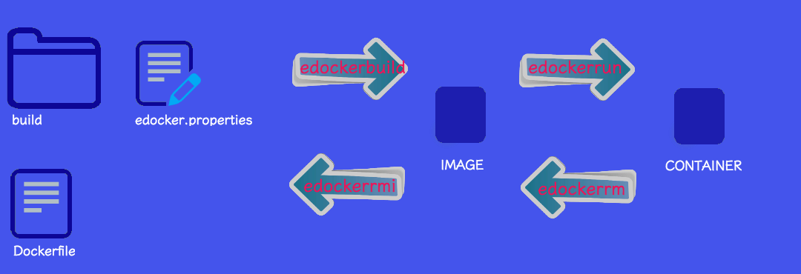

# Easy, compact, shortest Docker commands : edjanger

> Tired about repeating docker commands with long parameters ?
>
> Trying to find magic one from history. Putting commands in some exotical scripts ?
>
> Try edjanger !



## Install

**Prerequisities for installation**

- git
- zip

**Prerequisities for runtime**

- bc
- gettext (for envsubst)

<!---

> - bc

- Ubuntu / Debian

```
apt-get install bc
```

- CentOS / RHEL / Fedora

```bash
yum install bc
```

> - gettext (for envsubst)
- Ubuntu / Debian

```bash
apt-get install gettext
```

- CentOS / RHEL / Fedora

```bash
yum install gettext
```

- osx

```bash
brew install gettext
brew link --force gettext
echo "PATH=/usr/local/Cellar/gettext/0.19.8.1/bin/envsubst:$PATH" >> ~/.bashrc
source ~/.bashrc
```

- tree command (optional)

    - installation from binaries or from sources (http://mama.indstate.edu/users/ice/tree/)
-->
**Compatibility**

- os x El Capitan 10.11.6
- ubuntu > 14.04

**Installation**

```bash
git clone https://github.com/pamtrak06/edjanger.git /usr/local/bin
cd edjanger; chmod 755 scripts/*.sh; chmod 755 edjangerinstall.sh
```

Run edjanger installation
```bash
./edjangerinstall.sh --alias
```

This will install edjanger in /usr/local/bin/edjanger
If installation fail to install in this directory, try to install it in another, see [Linux Filesystem Hierarchy Standard](http://www.pathname.com/fhs/pub/fhs-2.3.pdf) for potential paths.

```bash
EDJANGER_INSTALL_PATH=<your path>
git clone https://github.com/pamtrak06/edjanger.git $EDJANGER_INSTALL_PATH
cd edjanger; chmod 755 scripts/*.sh; chmod 755 edjangerinstall.sh
```

Execute the generated alias file:
```bash
. /usr/local/bin/edjanger/edjanger.alias
```

All is done !!! Run this command to see your edjanger aliases
```bash
alias|grep edjanger
```

**Configuration**

~bash~

Bash as login shell will load /etc/profile, ~/.bash_profile, ~/.bash_login, ~/.profile in the order
Bash as non-login interactive shell will load ~/.bashrc
Bash as non-login non-interactive shell will load the configuration specified in environment variable $BASH_ENV

Add lines at the bottom of one of the following files:  
```bash
echo "source {edjanger path}/edjanger.alias" >> /etc/profile
```
or
```bash
echo "source {edjanger path}/edjanger.alias" >> ~/.bash_profile
```
or
```bash
echo "source {edjanger path}/edjanger.alias" >> ~/.bash_login
```
or
```bash
echo "source {edjanger path}/edjanger.alias" >> ~/.profile
```
or
```bash
echo "source {edjanger path}/edjanger.alias" >> ~/.bashrc
```
or
```bash
echo "source {edjanger path}/edjanger.alias" >> ~/.bash_aliases
```

**zsh**

Add lines at the bottom of the file ~/.zshrc
```bash
echo "source {edjanger path}/edjanger.alias" >> ~/.zshrc
```

**ksh**

Add lines at the bottom of the file ~/.profile  
```bash
echo "source {edjanger path}/edjanger.alias" >> ~/.profile
```

**bourne**

Add lines at the bottom of the file ~/.profile  
```bash
echo "source {edjanger path}/edjanger.alias" >> ~/.profile
```

**csh or tcsh**

Add lines at the bottom of the file ~/.login
```bash
echo "source {edjanger path}/edjanger.alias" >> ~/.login
```

### Uninstall

Remove edjanger aliases by executing:
```bash
source edjanger.unalias
```

Remove references to source command in ~/.bash_aliases
```bash
vi ~/.bash_aliases
```

Remove edjanger files
```bash
rm -rf {edjanger path}/
```

## Getting started


Create an uninitialized edjanger.properties file in your working docker folder:
```bash
edjangerinit
```
Equivalent to
```bash
> Initialize edjanger configuration file: edjanger.properties ...
cp [edjanger path]/templates/edjanger_template.properties [your docker working project]/edjanger.properties
> Initialize edjanger build folder for Dockerfile: /build ...
mkdir [your docker working project]/build
> Initialize Dockerfile: build/Dockerfile ...
touch [your docker working project]/build/Dockerfile
```

Configure your [edjanger.properties](https://github.com/pamtrak06/edjanger/blob/master/scripts/templates/edjanger_template.properties) with correct parameters.
By example, you could create a Dockerfile with this path:
```bash
vi [your docker working project]/build/Dockerfile
```
Example of a minimal edjanger configuration:
```bash
mkdir -p jenkins
cd jenkins; edjangerinit
vi edjanger.properties
```
```bash
#  ----------------------------------------------------
#  The MIT License (MIT)
#
#  Copyright (c) 2016 copyright pamtrak06@gmail.com
#  ----------------------------------------------------
#  CONFIGURATION    : edjanger_template.properties
#  DESCRIPTION      : project configuration file for edjanger
#  CREATOR          : pamtrak06@gmail.com
#  --------------------------------
#  VERSION          : 1.0
#  DATE             : 2016-03-02
#  COMMENT          : creation
#  --------------------------------
#  USAGE            : read by edjanger scripts
#  ----------------------------------------------------
#cron_build: flag to start container at boot
#cron_build=true
#cron_start: flag to start container at boot
cron_start=true
# docker_command:show docker command when edjanger is used
docker_command=true
# image_name:image name
image_name="devops/jenkins"
# build_path:path where is found Dockerfile
build_path=build
# build_args:build arguments
# build_args="--build-arg VAR1='value1' --build-arg VAR2='value2'"
# build_forcerm:always remove intermediate containers
# build_forcerm="--force-rm"
# build_rm: Remove intermediate containers after a successful build
# build_rm="--rm=true"
# build_nocache:do not use cache when building the image
# build_nocache="--no-cache"
# build_file:name of the Dockerfile (Default is 'PATH/Dockerfile')
# build_file="--file Dockerfile"
# container_name:container
container_name="jenkins"
# exposed_ports:exposed port
exposed_ports="-p 8080:8080 -p 50000:50000"
# shared_volumes:shared volumes
shared_volumes="-v $PWD/volumes/jenkins_home:/var/jenkins_home"
# volumes_from:expose volumes from another container into current container
# volumes_from="--volumes-from <container name with exposed volumes>"
# environment_variables:environnment variables
# environment_variables="-e <variable name 1>=<value 1> -e <variable name 2>=<value 2>"
# linked_containers:linked container
#linked_containers="--link dind_1:docker"
#network_settings:all network settings options
#network_settings=--dns [] --net host --network-alias [] --add-host "" --mac-address "" --ip "" --ip6 "" --link-local-ip []
#runtime_constraints_on_resources: runtime constraints on resources
#runtime_constraints_on_resources=-m, --memory "" --memory-swap "" --memory-reservation "" --kernel-memory "" ...
# force_rmi:force deletion
# force_rmi="--force"
# command_run:bash command(s) to run
# command_run="/bin/bash -c \"cd /; ls -la"
```

Update Dockerfile with jenkins reference from [docker hub](https://hub.docker.com/_/jenkins/)
```bash
touch build/Dockerfile
echo "FROM jenkins:latest" > build/Dockerfile
```

> Example 1: docker build
```bash
edjangerbuild
```
instead of:
```bash
docker build -t "devops/jenkins"       build
```

> Example 2: docker run
```bash
edjangerrun
```
instead of:
```bash
docker run -dt --name jenkins_1    -p 8080:8080 -p 50000:50000  -v /root/workspace/docker/devops/continuous_integration/jenkins/volumes/jenkins_home:/var/jenkins_home  --link dind_1:docker devops/jenkins
```

> Example 3: docker stop
```bash
edjangerstop
```
instead of:
```bash
docker stop $(docker ps -aq | grep "devops/jenkins")
```

## Best practices

Use a folder for each edjanger project.

Use following structure :
```bash
- [edjanger main project folder]
    - edjanger.properties   > edjanger project configuration
    - [build]               > docker build folder (contains Dockerfile and files dependencies)
        -  Dockerfile       > default Dockerfile
    - volumes               > contains all shared volumes
```

## Use cases : basic commands

All those command are compact and useful docker shortcuts !

|                   | Description                                                                     | IMAGE | CONTAINER |
 ------------------ | ------------------------------------------------------------------------------- | ----- | --------- |
| `edjangerbuild`   | "docker build" with parameters readed from local edjanger.properties.           |   X   |           |
| `edjangerclean`   | clean all images with none attribute (run docker rmi with "none" filter).       |   X   |           |
| `edjangercopy`    | "docker copy" with parameters readed from local edjanger.properties.            |       |     X     |
| `edjangerexec`    | "docker exec" with parameters readed from local edjanger.properties.            |       |     X     |
| `edjangerimages`  | "docker exec" with parameters readed from local edjanger.properties.            |   X   |           |
| `edjangerinspect` | "docker inspect" with parameters readed from local edjanger.properties.         |       |     X     |
| `edjangerlogs`    | "docker logs" with parameters readed from local edjanger.properties.            |       |     X     |
| `edjangerps`      | "docker ps" with parameters readed from local edjanger.properties.              |       |     X     |
| `edjangerpsa`     | "docker ps -a" with parameters readed from local edjanger.properties.           |       |     X     |
| `edjangerrename`  | "docker rename" with parameters readed from local edjanger.properties.          |       |     X     |
| `edjangerrestart` | "docker restart" with parameters readed from local edjanger.properties.         |       |     X     |
| `edjangerm`       | "docker rm" with parameters readed from local edjanger.properties.              |       |     X     |
| `edjangermi`      | "docker rmi" with parameters readed from local edjanger.properties.             |   X   |           |
| `edjangerun`      | "docker run -d" with parameters readed from local edjanger.properties.          |       |     X     |
| `edjangeruni`     | "docker run -it" with parameters readed from local edjanger.properties.         |       |     X     |
| `edockestart`     | "docker start" with parameters readed from local edjanger.properties.           |       |     X     |
| `edockestop`      | "docker stop" with parameters readed from local edjanger.properties.            |       |     X     |
| `edjangertag`     | "docker tag" with parameters readed from local edjanger.properties.             |       |     X     |
| `edjangertop`     | "docker top" with parameters readed from local edjanger.properties.             |       |     X     |

## Use cases : docker

|                     | Description                                                                   |
| ------------------- | ----------------------------------------------------------------------------- |
| `edjangerportdesc`  | "docker ports" on all running container.                                      |
| `edjangerports`     | description of port.                                                          |
| `edjangermexiteds`  | docker rm with list of container with exited status.                          |


## Use cases : useful

|                     | Description                                                                   |
| ------------------- | ----------------------------------------------------------------------------- |
| `edjangerabout`     | about script for edjanger.                                                    |
| `edjangercheck`     | check missing parameters in edjanger.properties.                              |
| `edjangeralias`     | print edjanger aliases.                                                       |
| `edjangerunalias`   | help script for edjanger command.                                             |


**Check missing parameters in edjanger.properties**

```bash
edjangercheck
Check edjanger.properties...
  - check "docker_command"
  - check "image_name"
  - check "build_path"
  - check "build_args"
    WARNING: parameter is missing !!!
  - check "build_forcerm"
    WARNING: parameter is missing !!!
  - check "build_rm"
    WARNING: parameter is missing !!!
  - check "build_nocache"
    WARNING: parameter is missing !!!
  - check "build_file"
    WARNING: parameter is missing !!!
  - check "container_name"
  - check "exposed_ports"
  - check "shared_volumes"
    WARNING: parameter is missing !!!
  - check "volumes_from"
    WARNING: parameter is missing !!!
  - check "environment_variables"
    WARNING: parameter is missing !!!
  - check "linked_containers"
    WARNING: parameter is missing !!!
  - check "force_rmi"
    WARNING: parameter is missing !!!
  - check "command_run"
    WARNING: parameter is missing !!!
  => STATUS of configuration is: some parameters are undefined
```

Remark : even when parameters are missing in edjanger.properties, they are initialized empty.


## Use case: compose

From an existing edjanger root path project structure, call edcokercompose.
Script will parse all edjanger.properties in subfolders and create docker-compose.yaml at upper path.

```bash
edjangercompose
vi docker-compose.yaml
```

## Use case: template

> Prerequisities : install gettext (for envsubst)

- Download and try example from [https://github.com/pamtrak06/edjanger/tree/master/scripts/templates/templating](https://github.com/pamtrak06/edjanger/tree/master/scripts/templates/templating), run:

- Deploy 2 apache web sever (web1 and web2) with specific ports and shared volumes for a "production" environement.
    ```bash
    ./deploy_run.sh production 5
    ```

- Deploy 2 apache web server (web1 and web2) with specific ports and shared volumes for an "integration" environement.
    ```bash
    ./deploy_run.sh integration 5
    ```

- Instructions
From an existing edjanger root path project structure, do following
    - rename all edjanger.properties to edjanger.template
    - define variable for element to be replaced with variable value from configuration file
    - create configuration files (<name>.properties) containing SHELL-FORMAT variable
        - in each folder containing edjanger.properties (each configuration file must hase same name e.g.: production.properties)
        or
        - only in root folder (e.g.: production.properties)
    - call edjangertemplate with name of configuration file

```
edjangertemplate <name>.properties
```

Example of edjangertemplate invocation

```
edjangertemplate production.properties
```

Example of production.properties content

```
#!/bin/bash
export HTTPD_PORT_80=80
export HTTPD_PORT_443=443
```

Example of edjanger.template content

```
#exposed_ports:exposed port
exposed_ports="-p ${HTTPD_PORT_80}:80 -p ${HTTPD_PORT_443}:443"
```

Script will find all edjanger.template and replace variables from root or folder(s) configuration(s) file(s) to produce edjanger.properties files.

Example of edjanger.properties produced

```
#exposed_ports:exposed port
exposed_ports="-p 80:80 -p 443:443"
```

## Use case : crontab

Configure automatic container restart at boot

To configure automatic restart of container at boot, configure edjanger.properties files :
- activate cron_start=true to start existing container at boot
- activate cron_build=true to build and start a new container at boot

Configure crontab with following parameters

```
crontab -e
@reboot {edjangerpath}/cron_build_start.sh {edjanger properties path}
@reboot {edjangerpath}/cron_start_only.sh {edjanger properties path}
```

Example:

```
crontab -e
@reboot /opt/edjanger/scripts/cron_build_start.sh /root/workspace/docker
@reboot /opt/edjanger/scripts/cron_start_only.sh /root/workspace/docker
```

## help

For each commands, see edjangerhelp 'command' for list of parameters read in edjanger.properties and arguments.


## Unit tests

Tests use following

- [travis](https://travis-ci.org/pamtrak06/edjanger)
- [bats](https://github.com/sstephenson/bats)

Result Tests are visible here

- [pamtrak06/edjanger from Travis](https://travis-ci.org/pamtrak06/edjanger)

Run tests :

```
cd [edjanger path];
./run_tests.sh
```

## License

 @Author : [Pamtrak06](mailto:pamtrak06@gmail.com), [GitHub sources](https://github.com/pamtrak06/edjanger)

edjanger is under  "MIT License (MIT)" see [LICENSE file](https://github.com/pamtrak06/edjanger/blob/master/LICENSE).
